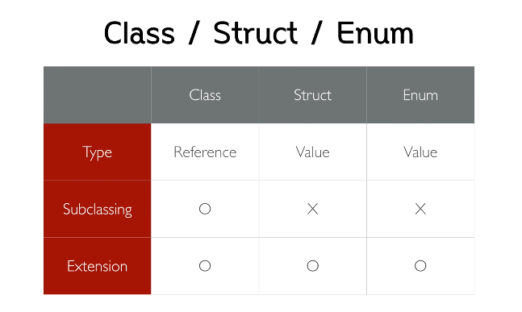

# Swift 기초

>  iOS 프로그래밍을 위한 스위프트 기초 (https://www.boostcourse.org/mo122/home)
>
>  내용 정리
>  
>  추가 공부 - T아카데미 Swift 프로그래밍 (2021. 4.)
>  
>  fast campus 강의 신청하기(타 강의도 찾아보기) 7월!


## 1단원 - 스위프트 기초

### 02. 명명법 / 콘솔로그 / 문자열 보간법

 1. **명명법**

- Swift는 모든 대소문자를 구분합니다.

  - **Lower Camel Case** : fuction, method, variable, constant

  ex.) someVariableName

  - **Upper Camel Case** : type(class, struct, enum, extension…)

  ex.) Person, Point, Week


2. **콘솔로그 남기기**

  - **print 함수** : 단순 문자열 출력

  - **dump 함수** : 인스턴스의 자세한 설명(description 프로퍼티)까지 출력

  


   3. **문자열 보간법 (String Interpolation)**

  - 프로그램 실행 중 문자열 내에 변수 또는 상수의 실질적인 값을 표현하기 위해 사용.

  ```swift
let age: Int = 10

print("HI. I AM \(age) years old.")

print("HI. She is \(age + 5) years old.")

// 출력
// HI. I AM 10 years old.
// HI. She is 15 years old
  ```


### 03. 상수와 변수

1. **상수와 변수 선언**

- **let** : 상수 선언 키워드
- **var** : 변수 선언 키워드 

```swift
// 상수와 변수 선언
let 상수이름: 타입 = 값 // 콜론(:)해주고 띄어쓰기
var 변수이름: 타입 = 값

// 값의 타입이 명확하다면 타입 생략 가능 - 명확히 적어주는게 좋음
let 상수이름 = 값
var 변수이름 = 값

// 상수와 변수 활용
let constant: String = "차후에 변경이 불가능한 상수 let"
var variable: String = "차후에 변경이 가능한 변수 var"

variable = "변수는 이렇게 차후에 다른 값을 할당할 수 있지만"
// constant = "상수는 차후에 값을 변경할 수 없습니다" // 오류발생
```


2. **상수 선언 후, 값 할당하기**

- 선언을 한 뒤, 나중에 값을 할당하려는 상수나 변수는 반드시 타입을 명시해야 합니다. 

```swift
let sum: Int
let inputA: Int = 100
let inputB: Int = 200

// 선언 후 첫 할당
sum = inputA + inputB

// sum = 1 // 그 이후에는 다시 값을 바꿀 수 없습니다, 오류발생

// 변수도 물론 차후에 할당하는 것이 가능합니다
var nickName: String

nickName = "hey"

// 변수는 차후에 다시 다른 값을 할당해도 문제가 없지요
nickName = "heyhey"
```


### 04. 기본 데이터 타입

1. **Swift의 기본 데이터 타입**

- Bool
- Int, UInt
- Float, Double
- Character, String
- **데이터 타입간의 변환이 까다로운, 암시적인 대입에 예민한 언어**


2. **Bool**

- true와 false만을 값으로 가지는 타입

```swift
var someBool: Bool = true
someBool = false
// someBool = 0 - 컴파일 오류발생
// someBool = 1 - 컴파일 오류발생
// Bool 타입에 정수를 왜 넣냐..! 라고 생각
```


3. **Int, UInt**

- **Int** : 정수 타입. 현재는 기본적으로 64비트 정수형
- **UInt** : 양의 정수 타입. 현재는 기본적으로 64비트 양의 정수형.

```swift
// Int
var someInt: Int = -100
// someInt = 100.1 // 컴파일 오류발생

//UInt
var someUInt: UInt = 100
// someUInt = -100 // 컴파일 오류발생
// someUInt = someInt // 컴파일 오류발생
```


4. **Float, Double**

- **Float** : 실수 타입. 32비트 부동소수형.
- **Double :** 실수 타입. 64비트 부동소수형.

```swift
// Float
var someFloat: Float = 3.14
someFloat = 3 // 가능

// Double
var someDouble: Double = 3.14
someDouble = 3
// someDouble = someFloat // 컴파일 오류발생
```


5. **Character, String**

- **Character** : 문자 타입. 유니코드 사용. 큰따옴표("") 사용.
- **String** : 문자열 타입. 유니코드 사용. 큰따옴표("") 사용.

```swift
// Character
var someCharacter: Character = "🇰🇷"
someCharacter = "😄"
someCharacter = "가"
someCharacter = "A"
// someCharacter = "하하하" // 컴파일 오류발생. 문자 아닌 문자열
print(someCharacter)

// String
var someString: String = "하하하 😄 "
someString = someString + "웃으면 복이와요"
print(someString)

// someString = someCharacter // 컴파일 오류발생
```


### 05. Any, AnyObject, nil

1. **Any**

- Swift의 **모든 타입**을 지칭하는 키워드

```swift
var someAny: Any = 100
someAny = "어떤 타입도 수용 가능합니다"
someAny = 123.12

// Any 타입에 Double 자료를 넣어두었더라도 Any는 Double 타입이 아니기 때문에 할당할 수 없다. 
// 명시적으로 타입을 변환해 주어야 함
let someDouble: Double = someAny  // 컴파일 오류발생
```


2. **AnyObject**

- **모든 클래스** 타입을 지칭하는 프로토콜

```swift
class SomeClass {}
var someAnyObject: AnyObject = SomeClass()

// AnyObject는 클래스의 인스턴스만 수용 가능하기 때문에 클래스의 인스턴스가 아니면 할당할 수 없다.
someAnyObject = 123.12    // 컴파일 오류발생
```


3. **nil**

- **없음**을 의미하는 키워드
- 다른 언어의 NULL, Null, null 등과 유사한 표현

```swift
// someAny는 Any 타입이고, someAnyObject는 AnyObject 타입이기 때문에 nil을 할당할 수 없다.
var someAny: Any = 100
var someAnyObject: AnyObject = SomeClass()

someAny = nil         // 컴파일 오류발생
someAnyObject = nil   // 컴파일 오류발생
```


### 06. 컬렉션 타입(Array, Dictionary, Set)

1. **Array**

- 멤버가 **순서(인덱스)** 를 가진 리스트 형태의 컬렉션 타입
- 여러가지 리터럴 문법을 활용할 수 있어 표현 방법이 다양하다.

```swift
// 1. Array 선언 및 생성
var integers: Array<Int> = Array<Int>()

// 위와 동일한 표현
// var integers: Array<Int> = [Int]()
// var integers: Array<Int> = []
// var integers: [Int] = Array<Int>()
// var integers: [Int] = [Int]()
// var integers: [Int] = []
// var integers = [Int]()


// 2. Array 활용
integers.append(1)
integers.append(100)

// Int 타입이 아니므로 Array에 추가할 수 없다
//integers.append(101.1)

print(integers)	// [1, 100]

// 멤버 포함 여부 확인
print(integers.contains(100)) // true
print(integers.contains(99)) // false

// 멤버 교체
integers[0] = 99

// 멤버 삭제
integers.remove(at: 0)
integers.removeLast()
integers.removeAll()

// 멤버 수 확인
print(integers.count)

// 인덱스를 벗어나 접근하려면 익셉션 런타임 오류발생
//integers[0]


// 3. 불변 Array: let을 사용하여 Array 선언
let immutableArray = [1, 2, 3]

// 수정이 불가능한 Array이므로 멤버를 추가하거나 삭제할 수 없다
//immutableArray.append(4)
//immutableArray.removeAll()
```


2. **Dictionary**

- `'키'` 와 `'값' `의 쌍으로 이루어진 컬렉션 타입
- Array와 비슷하게 여러가지 리터럴 문법을 활용할 수 있어 표현 방법이 다양하다.

```swift
// 1. Dictionary의 선언과 생성
// Key가 String 타입이고 Value가 Any인 빈 Dictionary 생성
var anyDictionary: Dictionary<String, Any> = [String: Any]()

// 위와 동일한 표현
// var anyDictionary: Dictionary <String, Any> = Dictionary<String, Any>()
// var anyDictionary: Dictionary <String, Any> = [:]
// var anyDictionary: [String: Any] = Dictionary<String, Any>()
// var anyDictionary: [String: Any] = [String: Any]()
// var anyDictionary: [String: Any] = [:]
// var anyDictionary = [String: Any]()


// 2. Dictionary 활용
// 키에 해당하는 값 할당
anyDictionary["someKey"] = "value"
anyDictionary["anotherKey"] = 100

print(anyDictionary) // ["someKey": "value", "anotherKey": 100]

// 키에 해당하는 값 변경
anyDictionary["someKey"] = "dictionary"
print(anyDictionary) ["someKey": "dictionary", "anotherKey": 100]

// 키에 해당하는 값 제거
anyDictionary.removeValue(forKey: "anotherKey")
anyDictionary["someKey"] = nil
print(anyDictionary)


// 3. 불변 Dictionary: let을 사용하여 Dictionary 선언
let emptyDictionary: [String: String] = [:]
let initalizedDictionary: [String: String] = ["name": "hey", "gender": "male"]

// 불변 Dictionary이므로 값 변경 불가
//emptyDictionary["key"] = "value"

// "name"이라는 키에 해당하는 값이 없을 수 있으므로 String 타입의 값이 나올 것이라는 보장이 없다.
// 컴파일 오류 발생
// let someValue: String = initalizedDictionary["name"]
```


3. **Set**

- 중복되지 않는 멤버가 순서없이 존재하는 컬렉션
- Array, Dictionary와 다르게 축약형이 존재하지 않음

```swift
// 1. Set 생성 및 선언
var integerSet: Set<Int> = Set<Int>() // 축약 문법 없음

// insert : 새로운 멤버 입력
// 동일한 값은 여러번 insert해도 한번만 저장
integerSet.insert(1)
integerSet.insert(99)
integerSet.insert(99)
integerSet.insert(99)
integerSet.insert(100)

print(intigerSet) // {100, 99, 1}

// contains: 멤버 포함 여부 확인
print(integerSet.contains(1)) // true
print(integerSet.contains(2)) // false

// remove: 멤버 삭제
integerSet.remove(99) // {100, 1}
integerSet.removeFirst() // {1}

// count: 멤버 개수
integerSet.count // 1


// 2. Set의 활용
// 멤버의 유일성이 보장되기 때문에 집합 연산에 활용 유용
let setA: Set<Int> = [1, 2, 3, 4, 5]
let setB: Set<Int> = [3, 4, 5, 6, 7]

// 합집합
let union: Set<Int> = setA.union(setB)
print(union) // [2, 4, 5, 6, 7, 3, 1]

// 합집합 오름차순 정렬
let sortedUnion: [Int] = union.sorted()
print(sortedUnion) // [1, 2, 3, 4, 5, 6, 7]

// 교집합
let intersection: Set<Int> = setA.intersection(setB)
print(intersection) // [5, 3, 4]

// 차집합
let subtracting: Set<Int> = setA.subtracting(setB)
print(subtracting) // [2, 1]
```


### 07.  함수 기본

1. **함수선언의 기본형태**

```swift
//func 함수이름(매개변수1이름: 매개변수1타입, 매개변수2이름: 매개변수2타입 ...) -> 반환타입 {
//    /* 함수 구현부 */
//    return 반환값
//}

// 예)
// sum이라는 이름을 가지고 
// a와 b라는 Int 타입의 매개변수를 가지며 
// Int 타입의 값을 반환하는 함수
func sum(a: Int, b: Int) -> Int {
    return a + b
}
```


2. **반환 값이 없는 함수**

```swift
//func 함수이름(매개변수1이름: 매개변수1타입, 매개변수2이름: 매개변수2타입 ...) -> Void {
//    /* 함수 구현부 */
//    return
//}

// 예)
func printMyName(name: String) -> Void {
    print(name)
}

// 반환 값이 없는 경우, 반환 타입(Void)을 생략해 줄 수 있습니다
func printYourName(name: String) {
    print(name)
}
```


3. **매개변수가 없는 함수**

```swift
//func 함수이름() -> 반환타입 {
//    /* 함수 구현부 */
//    return 반환값
//}

// 예)
func maximumIntegerValue() -> Int {
    return Int.max
}
```


4. **매개변수와 반환값이 없는 함수**

```swift
//func 함수이름() -> Void {
//    /* 함수 구현부 */
//    return
//}

// 함수 구현이 짧은 경우
// 가독성을 해치지 않는 범위에서
// 줄바꿈을 하지 않고 한 줄에 표현해도 무관합니다
func hello() -> Void { print("hello") }


// 반환 값이 없는 경우, 반환 타입(Void)을 생략해 줄 수 있습니다
//func 함수이름() {
//    /* 함수 구현부 */
//    return
//}

func bye() { print("bye") }
```


5. **함수의 호출**

```swift
sum(a: 3, b: 5) // 8

printMyName(name: "hey") // hey

printYourName(name: "hana") // hana

maximumIntegerValue() // Int의 최댓값

hello() // hello

bye() // bye
```


### 08. 함수 고급

1. **매개변수 기본 값**

- 매개변수에 기본적으로 전달될 값을 미리 지정해 둘 수 있다.
- 기본값을 갖는 매개변수는 매개변수 목록 중 뒤쪽에 위치하는 것이 좋다.

```swift
//func 함수이름(매개변수1이름: 매개변수1타입, 매개변수2이름: 매개변수2타입 = 매개변수 기본값 ...) -> 반환타입 {
//    /* 함수 구현부 */
//    return 반환값
//}

func greeting(friend: String, me: String = "hey") { // me 기본값 존재
    print("Hello \(friend)! I'm \(me)")
}

// 매개변수 기본값을 가지는 매개변수는 호출시 생략할 수 있다
greeting(friend: "hana") // Hello hana! I'm hey
greeting(friend: "john", me: "eric") // Hello john! I'm eric
```


2. **전달인자 레이블(Argument Label)**

- 함수를 호출할 때 함수 사용자의 입장에서 매개변수의 역할을 좀 더 명확하게 표현하고자 할 때 사용
- 전달인자 레이블은 변경하여 동일한 이름의 함수를 **중복**으로 생성가능

```swift
//func 함수이름(전달인자 레이블 매개변수1이름: 매개변수1타입, 전달인자 레이블 매개변수2이름: 매개변수2타입 ...) -> 반환타입 {
//    /* 함수 구현부 */
//    return
//}

// 함수 내부에서 전달인자를 사용할 때에는 매개변수 이름을 사용
func greeting(to friend: String, from me: String) {
    print("Hello \(friend)! I'm \(me)")
}

// 함수를 호출할 때에는 전달인자 레이블을 사용해야 합니다
greeting(to: "hana", from: "hey") // Hello hana! I'm hey
```


3. **가변 매개변수**

- 전달 받을 값의 개수를 알기 어려울 때 사용
- 가변 매개변수는 함수당 하나만 가질 수 있다.
- 기본값이 있는 매개변수와 같이 가변 매개변수 역시 매개변수 목록 중 뒤쪽에 위치하는 것이 좋다.
- 반환값이 없는 함수, 매개변수 기본 값, 전달인자 레이블, 가변 매개변수 등 모두 섞어서 사용 가능

```swift
//func 함수이름(매개변수1이름: 매개변수1타입, 전달인자 레이블 매개변수2이름: 매개변수2타입...) -> 반환타입 {
//    /* 함수 구현부 */
//    return
//}

func sayHelloToFriends(me: String, friends: String...) -> String {
    return "Hello \(friends)! I'm \(me)!"
}
print(sayHelloToFriends(me: "hey", friends: "hana", "eric", "wing"))
// Hello ["hana", "eric", "wing"]! I'm hey!

print(sayHelloToFriends(me: "hey"))
// Hello []! I'm hey!
```


4. **데이터 타입으로서의 함수**

- 스위프트는 함수형 프로그래밍 패러다임을 포함하는 다중 패러다임 언어이므로 스위프트의 함수는 일급객체이다. 함수를 변수, 상수 등에 할당이 가능하고 매개변수를 통해 전달할 수도 있다.
- **함수의 타입 표현** : 반환 타입을 생략할 수 없다.

`(매개변수1타입, 매개변수2타입 ...) -> 반환타입`

- **함수타입 사용**

```swift
var someFunction: (String, String) -> Void = greeting(to:from:)
someFunction("eric", "hey") // Hello eric! I'm hey

someFunction = greeting(friend:me:)
someFunction("eric", "hey") // Hello eric! I'm hey


// 타입이 다른 함수는 할당할 수 없다 - 컴파일 오류 발생
//someFunction = sayHelloToFriends(me: friends:) // friends 가 가변매개변수여서 안됨

// 함수를 매개변수로 직접 넘겨줄 수 있음
func runAnother(function: (String, String) -> Void) {
    function("jenny", "mike")
}

// Hello jenny! I'm mike
runAnother(function: greeting(friend:me:))

// Hello jenny! I'm mike
runAnother(function: someFunction)
```

* **스위프트 전반적인 문법에서 띄어쓰기를 신경써야할 때가 많다.**


### 09. 조건문

1.**if-else 구문**

- **if-else 구문의 기본 형태** 
- if만 단독으로 사용해도되고, else, else if 와 조합해서 사용 가능
- if 뒤의 조건 값에는 **Bool 타입**의 값만 위치해야 한다.
- 조건을 감싸는 소괄호 생략 가능. 중괄호는 생략 불가.

```swift
if 조건 {
     /* 실행 구문 */
} else if 조건 {
    /* 실행 구문 */
} else {
    /* 실행 구문 */
}
```

- **if-else의 사용**

```swift
let someInteger = 100

if someInteger < 100 {
    print("100 미만")
} else if someInteger > 100 {
    print("100 초과")
} else {
    print("100")
} // 100

// 스위프트의 조건에는 항상 Bool 타입이 들어와야 함
// someInteger는 Bool 타입이 아닌 Int 타입이기 때문에
// 컴파일 오류 발생
//if someInteger { }
```


2. **switch 구문**

- 스위프트의 switch 구문은 다른 언어에 비해 강력한 힘을 발휘
- 기본적으로 사용하던 정수타입의 값만 비교하는 것이 아니라 대부분의 스위프트 기본 타입을 지원하며, 다양한 패턴과 응용 가능
- 스위프트의 다양한 패턴은 [Swift Programming Language Reference의 패턴](https://developer.apple.com/library/content/documentation/Swift/Conceptual/Swift_Programming_Language/패턴s.html) 에서 확인할 수 있다.

- 각각의 case 내부에는 실행가능한 코드가 반드시 위치해야 함
- 매우 한정적인 값(ex. enum의 case 등)이 비교값이 아닌 한 **default 구문은 반드시 작성**해야 함
- 명시적 break를 하지 않아도 **자동으로 case마다 break**
- fallthrough 키워드를 사용하여 break를 무시할 수 있다.
- 쉼표(,)를 사용하여 하나의 case에 여러 패턴을 명시할 수 있다.

- **switch 구문의 기본 형태**

```swift
switch 비교값 {
case 패턴:
    /* 실행 구문 */
default:
    /* 실행 구문 */
}
```

- **switch 구문의 사용**

```swift
let someInteger = 100
// 범위 연산자 활용하면 더욱 쉽고 유용
switch someInteger {
case 0:
    print("zero")
case 1..<100: // .. : 1이상 100미만
    print("1~99")
case 100:
    print("100")
case 101...Int.max: // ... : 이상,이하
    print("over 100")
default:
    print("unknown")
} // 100

// 정수 외의 대부분의 기본 타입을 사용할 수 있다
switch "hey" {
case "jake": // 케이스 여러개 동일 동작 하려면 ,로 연결 혹은 fallthrough 사용
    print("jake")
case "mina":
    print("mina")
case "hey":
    print("hey!!")
default:
    print("unknown")
} // hey!!
```


### 10. 반복문

1. **for-in 구문**

- 기존 언어의 for-each 구문과 유사
- Dictionary의 경우 이터레이션 아이템으로 튜플이 들어온다.
- **for-in 구문 기본 형태**

```swift
for item in items {
    /* 실행 구문 */
}
```

- **for-in 구문의 사용**

```swift
var integers = [1, 2, 3]
let people = ["yagom": 10, "eric": 15, "mike": 12]

for integer in integers {
    print(integer)
}

// Dictionary의 item은 key와 value로 구성된 튜플 타입
for (name, age) in people {
    print("\(name): \(age)")
}
```


2. **while 구문**

- **while 구문의 기본 형태**

```swift
while 조건 {
    /* 실행 구문 */
}
```

- **while 구문의 사용**

```swift
while integers.count > 1 { // Bool 값만
    integers.removeLast()
}
```


3. **repeat-while 구문**

- 기존 언어의 **do-while** 구문과 형태/동작이 유사 -> `do` 가 오류 처리에서 사용되어 다르게 불림
- **repeat-while 구문의 기본 형태**

```swift
repeat {
    /* 실행 구문 */
} while 조건
```

- **repeat-while 구문의 사용**

```swift
repeat {
    integers.removeLast()
} while integers.count > 0
```


### 11. 옵셔널

1. **옵셔널이란??**

- **값이 있을 수도, 없을 수도 있음**
- **nil**이 할당 될 수 있는지 없는지 표현

```swift
// someOptionalParm에 nil이 할당 될 수 있다.
func someFunction(someOptionalParam: Int?) {
       // ....
}

/// someParm에 nil이 할당 될 수 없다.
func someFunction(someParam: Int) {
       // ....
}

someFunction(someOptionalParam: nil) // 옵셔널 파라미터 nil 보낼 수 있음 
// someFunction(someParam: nil) // nil 파라미터로 보낼 수 없음
```


2. **옵셔널을 쓰는 이유**

- **명시적 표현**
  1. nil의 가능성을 코드만으로 표현가능
  2. 문서/주석 작성 시간 절약

- **안전한 사용**
  1. 전달받은 값이 옵셔널이 아니라면 nil 체크를 하지 않고 사용가능
  2. 예외 상황을 최소화 하는 안전한 코딩
  3. 효율적 코딩


3. **옵셔널 문법과 선언**

- 옵셔널 문법 = enum + generics 
- 옵셔널 선언 - 열거형

```swift
enum Optional<Wrapped>: ExpressibleByNiliteral {
         case none
         case some(Wrapped)
}

let optionalValue: Optional<Int> = nil
let optionalValue: Int? = nil // Int의 옵셔널 타입. ? 띄어쓰면 안됨.
```


- **옵셔널 표현**

1. **느낌표**를 이용한 `암시적 추출 옵셔널 `

```swift
// Implicitly Unwrapped Optional
var OptionalValue: Int! = 100

switch OptionalValue {
case .none:
    print("This Optional variable is nil")
case .some(let value):
    print("Value is \(value)")
}

// 기존 변수처럼 사용 가능
OptionalValue = OptionalValue + 1

// nil 할당 가능
OptionalValue = nil

// 잘못된 접근으로 인한 런타임 오류 발생
// nil 대입 후 값에 접근하려 하여서
//OptionalValue = OptionalValue + 1
```

2. **물음표**를 이용한 옵셔널

```swift
// Optional
var optionalValue: Int? = 100 // Int형이 들어있을수도 없을수도(nil) 있다.

switch optionalValue {
case .none:
    print("This Optional variable is nil")
case .some(let value):
    print("Value is \(value)")
}

// nil 할당 가능
optionalValue = nil

// 기존 변수처럼 사용불가 - 옵셔널과 일반 값은 다른 타입이므로 연산불가
//optionalValue = optionalValue + 1
```


### 12. 옵셔널 추출

1. **옵셔널 추출이란?** 

- 옵셔널에 들어있는 값을 사용하기 위해 꺼내오는 것


2. **옵셔널 방식**

- **옵셔널 바인딩**

	1. **nil 체크 + 안전한 추출**
	2. 옵셔널 안에 값이 들어있는지 확인하고 값이 있으면 값을 꺼내온다.
	3. `if-let` 방식 사용
```swift
func printName(_ name: String) {
    print(name)
}

var myName: String? = nil // 옵셔널 타입

//printName(myName)
// 전달되는 값의 타입(스트링 타입 아닌 옵셔널 타입)이 다르기 때문에 컴파일 오류발생

if let name: String = myName { // 변수 name은 if let 구문 내에서만 사용 가능
    printName(name)
} else {
    print("myName == nil")
}


var yourName: String! = nil

if let name: String = yourName {
    printName(name)
} else {
    print("yourName == nil")
}


// ,를 사용해 한 번에 여러 옵셔널을 바인딩 가능
// 모든 옵셔널에 값이 있을 때만 동작 (하나라도 nil 이면 X)
myName = "hey"
yourName = nil

if let name = myName, let friend = yourName { 
    print("\(name) and \(friend)")
}
// yourName이 nil이기 때문에 실행 X

yourName = "hana"

if let name = myName, let friend = yourName {
    print("\(name) and \(friend)")
}
// hey and hana
```


- **강체추출 **
1. 옵셔널에 값이 들어있는지 아닌지 확인하지 않고 강제로 값을 꺼내는 방식
2. 만약 값이 없을경우(nil), **런타임 오류**가 발생하기 때문에 추천되지 않는다.

```swift
var myName: String? = "hey"
var youName: String! = nil // 암시적 추출로 선언된 옵셔널 변수는 printName(yourName) 구문에서 !있다 가정됨.


printName(myName!) // 값 있음 -> hey 강제추출

myName = nil 

//print(myName!)
// 값이 없으므로 런타임 오류 발생

yourName = nil

//printName(yourName) // ! 없이 강제추출 가능. 알아서 붙여서 넘겨줌.
// nil 값이 전달되기 때문에 런타임 오류발생
```


## 2단원 - 다양한 표현 및 확장

### 13. 구조체

1. **구조체란?**

- 스위프트 대부분 타입은 구조체로 이루어져 있다.
- 구조체는 **값(value) 타입**
- 타입이름은 대문자 카멜케이스를 사용하여 정의


2. **구조체 문법**

- **구조체 정의 :** `struct` 키워드 사용

```swift
struct 이름 {
	/* 구현부 */
}
```

- **구조체 프로퍼티 및 메서드 구현** (변수, 함수)

```swift
struct Sample {
    // 가변 프로퍼티(값 변경 가능)
    var mutableProperty: Int = 100 
    
    // 불변 프로퍼티(값 변경 불가능)
    let immutableProperty: Int = 100 
    
    // 타입 프로퍼티(static 키워드 사용 : 타입 자체가 사용하는 프로퍼티)
    static var typeProperty: Int = 100 
    
    // 인스턴스 메서드(인스턴스가 사용하는 메서드)
    func instanceMethod() {
        print("instance method")
    }
    
    // 타입 메서드(static 키워드 사용 : 타입 자체가 사용하는 메서드)
    static func typeMethod() {
        print("type method")
    }
}
```

- **구조체 사용**

```swift
// 가변 인스턴스 생성
var mutable: Sample = Sample()

mutable.mutableProperty = 200

// 불변 프로퍼티는 인스턴스 생성 후 수정할 수 없다
// 컴파일 오류 발생
//mutable.immutableProperty = 200

// 불변 인스턴스
let immutable: Sample = Sample()

// 불변 인스턴스는 아무리 가변 프로퍼티라도
// 인스턴스 생성 후에 수정할 수 없다
// 컴파일 오류 발생
//immutable.mutableProperty = 200
//immutable.immutableProperty = 200


// 타입 프로퍼티 및 메서드
Sample.typeProperty = 300
Sample.typeMethod() // type method

// 인스턴스에서는 타입 프로퍼티나 타입 메서드를
// 사용할 수 없다
// 컴파일 오류 발생
//mutable.typeProperty = 400
//mutable.typeMethod()
```


3. **학생 구조체 만들어보기**

```swift
struct Student {
	// 가변 프로퍼티
    var name: String = "unknown"

    // 기존 키워드도 `로 묶어주면 이름으로 사용할 수 있다
    var `class`: String = "Swift"
    
    // 타입 메서드
    static func selfIntroduce() {
        print("학생타입입니다")
    }
    
    // 인스턴스 메서드
    // self는 인스턴스 자신을 지칭. 몇몇 경우를 제외하고 사용은 선택사항
    func selfIntroduce() {
        print("저는 \(self.class)반 \(name)입니다")
    }
}

// 타입 메서드 사용
Student.selfIntroduce() // 학생타입입니다

// 가변 인스턴스 생성
var hey: Student = Student()
hey.name = "hey"
hey.class = "스위프트"
hey.selfIntroduce()   // 저는 스위프트반 hey입니다

// 불변 인스턴스 생성
let jina: Student = Student()

// 불변 인스턴스이므로 프로퍼티 값 변경 불가
// 컴파일 오류 발생
//jina.name = "jina"
jina.selfIntroduce() // 저는 Swift반 unknown입니다
```


### 14. 클래스

1. **클래스란?**

- 클래스는 **참조(reference) 타입**
- 타입이름은 대문자 카멜케이스 사용하여 정의
- Swift의 클래스는 다중 상속이 되지 않는다.


2. **클래스 문법**

- **정의 :** `class` 키워드 사용

```swift
class 이름 {
	/* 구현부 */
}
```

- **프로퍼티 및 메서드 구현**

```swift
class Sample {
    // 가변 프로퍼티
    var mutableProperty: Int = 100 

    // 불변 프로퍼티
    let immutableProperty: Int = 100 
    
    // 타입 프로퍼티
    static var typeProperty: Int = 100 
    
    // 인스턴스 메서드
    func instanceMethod() {
        print("instance method")
    }
    

    // 타입 메서드
    // 상속시 재정의 불가 타입 메서드 - static
    static func typeMethod() {
        print("type method - static")
    }
    
    // 상속시 재정의 가능 타입 메서드 - class
    class func classMethod() {
        print("type method - class")
    }
}
```

- **클래스 사용**

```swift
// 인스턴스 생성 - 참조정보 수정 가능
var mutableReference: Sample = Sample()

mutableReference.mutableProperty = 200

// 불변 프로퍼티는 인스턴스 생성 후 수정할 수 없다
// 컴파일 오류 발생
//mutableReference.immutableProperty = 200


// 인스턴스 생성 - 참조정보 수정 불가
let immutableReference: Sample = Sample()

// 클래스의 인스턴스는 참조 타입이므로 let으로 선언되었더라도 인스턴스 프로퍼티의 값 변경 가능
immutableReference.mutableProperty = 200

// 다만 참조정보를 변경할 수는 없다
// 컴파일 오류 발생
//immutableReference = mutableReference

// 참조 타입이라도 불변 인스턴스는 
// 인스턴스 생성 후에 수정할 수 없다
// 컴파일 오류 발생
//immutableReference.immutableProperty = 200


// 타입 프로퍼티 및 메서드
Sample.typeProperty = 300
Sample.typeMethod() // type method

// 인스턴스에서는 타입 프로퍼티나 타입 메서드를
// 사용할 수 없다
// 컴파일 오류 발생
//mutableReference.typeProperty = 400
//mutableReference.typeMethod()
```


3. **학생 클래스 만들어 보기**

```swift
class Student {
	// 가변 프로퍼티
    var name: String = "unknown"

    // 키워드도 `로 묶어주면 이름으로 사용할 수 있다
    var `class`: String = "Swift"
    
    // 타입 메서드
    class func selfIntroduce() {
        print("학생타입입니다")
    }
    
    // 인스턴스 메서드
    // self는 인스턴스 자신을 지칭. 몇몇 경우를 제외하고 사용은 선택사항
    func selfIntroduce() {
        print("저는 \(self.class)반 \(name)입니다")
    }
}

// 타입 메서드 사용
Student.selfIntroduce() // 학생타입입니다

// 인스턴스 생성
var hey: Student = Student()
hey.name = "hey"
hey.class = "스위프트"
hey.selfIntroduce()   // 저는 스위프트반 hey입니다

// 인스턴스 생성
let jina: Student = Student()
jina.name = "jina" // struct와 다름
jina.selfIntroduce() // 저는 Swift반 jina입니다
```


### 15. 열거형

1. **열거형** 

- 다른 언어의 열거형과 많이 다르다.

- 유사한 종류의 여러 값을 한 곳에 모아서 정의한 것  예) 요일, 월, 계절 등
- enum 자체가 하나의 데이터 타입. 대문자 카멜케이스 사용하여 이름 정의
- 각 case는 소문자 카멜케이스로 정의
- 각 case는 그 자체가 고유의 값(각 case에 자동으로 정수값이 할당되지 않음)
- 각 case는 한 줄에 개별, 또는 여러개 정의할 수 있다.

```swift
enum 이름 {
	case 이름1
	case 이름2
	case 이름3, 이름4, 이름5
	// ...
}

// 예제
enum BoostCamp {
  case iosCamp
  case androidCamp
  case webCamp
}
```


2. **열거형 사용** 

- 타입이 명확할 경우, 열거형의 이름을 생략 할 수 있다. 

```swift
enum Weekday {
    case mon
    case tue
    case wed
    case thu, fri, sat, sun
}

// 열거형 타입과 케이스 모두 사용 가능
var day: Weekday = Weekday.mon

// 타입이 명확하다면 .케이스 처럼 표현해도 무방
day = .tue

print(day) // tue

// switch의 비교값에 열거형 타입이 위치할 때
// 모든 열거형 케이스를 포함한다면
// default를 작성할 필요가 없다
switch day {
case .mon, .tue, .wed, .thu:
  print("평일입니다")
case Weekday.fri:
    print("불금 파티!!")
case .sat, .sun:
    print("신나는 주말!!")
}
```


3. **rawValue (원시값)**

- C 언어의 enum 처럼 정수값을 가질 수 있다.
- rawValue는 case별로 각각 다른 값을 가져야한다.
- 자동으로 1이 증가된 값 할당
- rawValue를 반드시 지닐 필요가 없다면 굳이 만들지 않아도 된다.

```swift
enum Fruit: Int {
    case apple = 0
    case grape = 1
    case peach
    
    // mango와 apple의 원시값이 같으므로 
    // mango 케이스의 원시값을 0으로 정의할 수 없다
//    case mango = 0
}

print("Fruit.peach.rawValue == \(Fruit.peach.rawValue)")
// Fruit.peach.rawValue == 2 // 이전 값보다 1 증가한 값 자동 할당
```

- 정수 타입 뿐만 아니라, Hashable 프로토콜을 따르는 모든 타입을 원시값의 타입으로 지정 할 수있다.

```swift
enum School: String {
    case elementary = "초등"
    case middle = "중등"
    case high = "고등"
    case university
}

print("School.middle.rawValue == \(School.middle.rawValue)")
// School.middle.rawValue == 중등

// 열거형의 원시값 타입이 String일 때, 원시값이 지정되지 않았다면
// case 이름을 원시값으로 사용
print("School.university.rawValue == \(School.university.rawValue)")
// School.middle.rawValue == university
```


4. **원시값을 통한 초기화**

- rawValue를 통해 초기화 할 수 있다.
- rawValue가 case에 해당하지 않을 수 있으므로, rawValue를 통해 초기화 한 인스턴스는 **옵셔널 타입**

```swift
// rawValue를 통해 초기화 한 열거형 값은 옵셔널 타입이므로(값이 nil일수도 있으므로) Fruit 타입이 아님
//let apple: Fruit = Fruit(rawValue: 0)
let apple: Fruit? = Fruit(rawValue: 0)

// if let 구문을 사용하면 rawValue에 해당하는 케이스를 곧바로 사용할 수 있다
if let orange: Fruit = Fruit(rawValue: 5) {
    print("rawValue 5에 해당하는 케이스는 \(orange)입니다")
} else {
    print("rawValue 5에 해당하는 케이스가 없습니다")
} // rawValue 5에 해당하는 케이스가 없습니다
```


5. **메서드** 

- Swift의 열거형에는 메서드도 추가할 수 있다.

```swift
enum Month {
    case dec, jan, feb
    case mar, apr, may
    case jun, jul, aug
    case sep, oct, nov
    
    func printMessage() {
        switch self {
        case .mar, .apr, .may:
            print("따스한 봄~")
        case .jun, .jul, .aug:
            print("여름 더워요~")
        case .sep, .oct, .nov:
            print("가을은 독서의 계절!")
        case .dec, .jan, .feb:
            print("추운 겨울입니다")
        }
    }
}

Month.mar.printMessage()
```


### 16. 클래스 vs 구조체 / 열거형



- 클래스는 **참조 타입**, 열거형과 구조체는 **값 타입**이라는 것이 가장 큰 차이
- 클래스는 상속(단일상속)이 가능하지만, 열거형과 구조체는 상속이 불가능


1. **값 타입과 참조 타입 비교**

- 값 타입(Value Type) : 데이터를 전달 할 때 값을 복사하여 전달
- 참조 타입(Reference Type) : 데이터를 전할 할 때 값의 메모리 위치를 전달

```swift
struct ValueType {
    var property = 1
}

class ReferenceType {
    var property = 1
}

// 첫 번째 구조체 인스턴스
let firstStructInstance = ValueType()

// 두 번째 구조체 인스턴스에 첫 번째 인스턴스 값 복사
var secondStructInstance = firstStructInstance

// 두 번째 구조체 인스턴스 프로퍼티 값 수정
secondStructInstance.property = 2

// 두 번째 구조체 인스턴스는 첫 번째 구조체를 똑같이 복사한 
// 별도의 인스턴스이기 때문에 
// 두 번째 구조체 인스턴스의 프로퍼티 값을 변경해도
// 첫 번째 구조체 인스턴스의 프로퍼티 값에는 영향이 없음
print("first struct instance property : \(firstStructInstance.property)")    // 1
print("second struct instance property : \(secondStructInstance.property)")  // 2


// 클래스 인스턴스 생성 후 첫 번째 참조 생성
let firstClassReference = ReferenceType()
// 두 번째 참조 변수에 첫 번째 참조 할당
let secondClassReference = firstClassReference
secondClassReference.property = 2

// 두 번째 클래스 참조는 첫 번째 클래스 인스턴스를 참조하기 때문에
// 두 번째 참조를 통해 인스턴스의 프로퍼티 값을 변경하면
// 첫 번째 클래스 인스턴스의 프로퍼티 값을 변경하게 됨
print("first class reference property : \(firstClassReference.property)")    // 2
print("second class reference property : \(secondClassReference.property)")  // 2
```


2. **값 타입을 사용하는 경우**

- 연관된 몇몇의 값들을 모아서 하나의 데이터 타입으로 표현하고 싶은 경우
- 다른 객체 또는 함수 등으로 전달될 때 참조가 아니라 복사(값 복사) 할 경우
- 자신을 상속할 필요가 없거나, 다른 타입을 상속 받을 필요가 없는 경우


**3. 스위프트에서의 사용**

- 스위프트의 기본 데이터 타입은 모두 구조체로 구현되어있다.
- 스위프트는 구조체와 열거형 사용 선호
- Apple 프레임워크는 대부분 클래스 사용
- 구조체/클래스 선택과 사용은 개발자의 몫


### 17. 클로저 기본

1. **클로저**

- 실행가능한 코드 블럭
- 함수와 다르게 이름 정의는 필요하지 않음
- 매개변수 전달과 반환 값이 존재 할 수 있다는 점은 동일
- 함수는 이름이 있는 클로저
- 일급객체로 전달인자, 변수, 상수 등에 저장 및 전달 가능


2. **기본 클로저 문법**

- 클로저는 중괄호 { }로 감싸져있다.
- 괄호 이용해 파라미터 정의
- -> 을 이용해 반환 타입 명시
- `in` 키워드를 이용해 실행 코드와 분리

```swift
{ (매개변수 목록) -> 반환타입 in
    실행 코드
}
```


3. **클로저 사용**

```swift
// sum이라는 상수에 클로저 할당
let sum: (Int, Int) -> Int = { (a: Int, b: Int) in
    return a + b
}

let sumResult: Int = sum(1, 2)
print(sumResult) // 3
```


4. **함수의 전달인자로서의 클로저**

- 클로저는 주로 함수의 전달인자로 많이 사용
- 함수 내부에서 원하는 코드블럭 실행 가능

```swift
let add: (Int, Int) -> Int
add = { (a: Int, b: Int) in
    return a + b
}

let substract: (Int, Int) -> Int
substract = { (a: Int, b: Int) in
    return a - b
}

let divide: (Int, Int) -> Int
divide = { (a: Int, b: Int) in
    return a / b
}

// 함수 안에서 전달받은 클로저 호출
func calculate(a: Int, b: Int, method: (Int, Int) -> Int) -> Int {
    return method(a, b)
}

var calculated: Int

calculated = calculate(a: 50, b: 10, method: add)

print(calculated) // 60

calculated = calculate(a: 50, b: 10, method: substract)

print(calculated) // 40

calculated = calculate(a: 50, b: 10, method: divide)

print(calculated) // 5

//따로 클로저를 상수/변수에 넣어 전달하지 않고, 
//함수를 호출할 때 클로저를 작성하여 전달할 수도 있다.

calculated = calculate(a: 50, b: 10, method: { (left: Int, right: Int) -> Int in
    return left * right
})

print(calculated) // 500
```


### 18. 클로저 고급

- 클로저는 아래 규칙을 통해 다양한 모습으로 표현될 수 있다. 

1. **후행 클로저** : 함수의 매개변수 중 마지막으로 전달되는 클로저는 함수 밖에서 구현 가능
2. **반환타입 생략** : 컴파일러가 클로저의 타입을 유추할 수 있는 경우 매개변수, 반환 타입 생략 가능
3. **단축 인자 이름** : 전달인자의 이름이 굳이 필요없고, 컴파일러가 타입을 유추할 수 있는 경우 축약된 전달인자 이름(`$0`, `$1`, `$2`...) 사용 가능 
4. **암시적 반환 표현** : 반환 값이 있는 경우, 암시적으로 클로저의 맨 마지막 줄은 `return` 키워드를 생략하더라도 반환 값으로 취급


- **기본 클로저 표현**

```swift
// 클로저를 매개변수로 갖는 함수 calculated(a:b:method:)와 결과값을 저장할 변수 result 선언
func calculate(a: Int, b: Int, method: (Int, Int) -> Int) -> Int {
    return method(a, b)
}

var result: Int
```


1. **후행 클로저**

- 클로저가 함수의 마지막 전달인자일때, 마지막 매개변수 이름을 생략한 후 함수 소괄호 외부에 클로저를 구현할 수 있다.

```swift
result = calculate(a: 10, b: 10) { (left: Int, right: Int) -> Int in
    return left + right
}

print(result) // 20
```


2. **반환타입 생략**

- `calculate(a:b:method:)` 함수의 `method` 매개변수는 `Int` 타입을 반환할 것이라는 사실을 컴파일러도 알기 때문에 굳이 클로저에서 반환타입을 명시해 주지 않아도 된다. 
- `in` 키워드는 생략할 수 없다.

```swift
result = calculate(a: 10, b: 10, method: { (left: Int, right: Int) in
    return left + right
})

print(result) // 20

// 후행클로저와 함께 사용할 수도 있다
result = calculate(a: 10, b: 10) { (left: Int, right: Int) in
    return left + right
}

print(result) // 20
```


3. **단축 인자이름**

- 클로저의 매개변수 이름이 불필요하다면 단축 인자이름을 활용할 수 있다. 
- 단축 인자이름은 클로저의 매개변수의 순서대로 `$0`, `$1`, `$2`... 표현

```swift
result = calculate(a: 10, b: 10, method: {
    return $0 + $1
})

print(result) // 20


// 당연히 후행 클로저와 함께 사용할 수 있다
result = calculate(a: 10, b: 10) {
    return $0 + $1
}

print(result) // 20
```


4. **암시적 반환 표현**

- 클로저가 반환하는 값이 있다면 클로저의 마지막 줄의 결과값은 암시적으로 반환값으로 취급한다.

```swift
result = calculate(a: 10, b: 10) {
    $0 + $1
}

print(result) // 20

// 간결하게 한 줄로 표현해 줄 수도 있다
result = calculate(a: 10, b: 10) { $0 + $1 }

print(result) // 20
```


5. 축약 전과 후 비교

```swift
//축약 전
result = calculate(a: 10, b: 10, method: { (left: Int, right: Int) -> Int in
    return left + right
})

//축약 후
result = calculate(a: 10, b: 10) { $0 + $1 }

print(result) // 20
```


### 19. 프로퍼티

1. **프로퍼티의 종류**

- **인스턴스 저장 프로퍼티**
- **타입 저장 프로퍼티**
- **인스턴스 연산 프로퍼티**
- **타입 연산 프로퍼티**
- 지연 저장 프로퍼티


2. **정의와 사용**

- 프로퍼티는 구조체, 클래스, 열거형 내부에 구현할 수 있다.
- 다만 열거형 내부에는 연산 프로퍼티만 구현할 수 있다.
- 연산 프로퍼티는 `var`로만 선언할 수 있다.
- 연산프로퍼티를 **읽기 전용**으로는 구현할 수 있지만, 쓰기 전용으로는 구현할 수 없다.
- 읽기전용으로 구현하려면 `get` 블럭만 작성해주면 된다.  `get`블럭은 생략할 수 있다.
- 읽기, 쓰기 모두 가능하게 하려면 `get` 블럭과 `set`블럭 모두 구현해주면 된다.
- `set` 블럭에서 **암시적 매개변수** `newValue`를 사용할 수 있다.

```swift
struct Student {
    
    // 인스턴스 저장 프로퍼티
    var name: String = ""
    var `class`: String = "Swift"
    var koreanAge: Int = 0
    
    // 인스턴스 연산 프로퍼티
    var westernAge: Int {
        get {
            return koreanAge - 1
        }
        
        set(inputValue) {
            koreanAge = inputValue + 1
        }
    }
    
    // 타입 저장 프로퍼티
    static var typeDescription: String = "학생"
    
    /*
    // 인스턴스 메서드
    func selfIntroduce() {
        print("저는 \(self.class)반 \(name)입니다")
    }
     */
    
    // 읽기전용 인스턴스 연산 프로퍼티
    // 간단히 위의 selfIntroduce() 메서드를 대체할 수 있다
    var selfIntroduction: String {
        get {
            return "저는 \(self.class)반 \(name)입니다"
        }
    }
        
    /*
     // 타입 메서드
     static func selfIntroduce() {
     print("학생타입입니다")
     }
     */
    
    // 읽기전용 타입 연산 프로퍼티
    // 읽기전용에서는 get 생략할 수 있다
    static var selfIntroduction: String {
        return "학생타입입니다"
    }
}

// 타입 연산 프로퍼티 사용
print(Student.selfIntroduction)
// 학생타입입니다

// 인스턴스 생성
var hey: Student = Student()
hey.koreanAge = 10

// 인스턴스 저장 프로퍼티 사용
hey.name = "hey"
print(hey.name)
// hey

// 인스턴스 연산 프로퍼티 사용
print(hey.selfIntroduction)
// 저는 Swift반 hey입니다

print("제 한국나이는 \(hey.koreanAge)살이고, 미국나이는 \(hey.westernAge)살입니다.")
// 제 한국나이는 10살이고, 미국나이는 9살입니다.
```

 


3. **응용**

```swift
struct Money {
    var currencyRate: Double = 1100
    var dollar: Double = 0
    var won: Double {
        get {
            return dollar * currencyRate
        }
        set {
            dollar = newValue / currencyRate // 매개변수 안 적어줘도 newValue 암시적으로
        }
    }
}

var moneyInMyPocket = Money()

moneyInMyPocket.won = 11000

print(moneyInMyPocket.won)
// 11000

moneyInMyPocket.dollar = 10

print(moneyInMyPocket.won)
// 11000
```


4. **지역변수 및 전역변수**

- 저장 프로퍼티와 연산 프로퍼티의 기능은 함수, 메서드, 클로저, 타입 등의 외부에 위치한 지역/전역 변수에도 모두 사용 가능

```swift
var a: Int = 100
var b: Int = 200
var sum: Int {
    return a + b
}

print(sum) // 300
```


### 20. 프로퍼티 감시자

1. **프로퍼티 감시자**

- 프로퍼티 감시자를 사용하면 **프로퍼티의 값이 변경**될 때 원하는 동작을 수행할 수 있다.
- 값이 변경되기 직전에 `willSet` 블럭이, 값이 변경된 직후에 `didSet`블럭이 호출된다.
- 둘 중 하나만 구현해 주어도 무관
- 변경되려는 값이 **기존 값과 똑같더라도** 프로퍼티 감시자는 항상 동작
- **`willSet`** 블럭에서는 암시적 매개변수 **`newValue`** 를, **`didSet`** 블럭에서는 **`oldValue`** 를 사용
- **연산 프로퍼티에는 사용할 수 없다.**
- 함수, 메서드, 클로저, 타입 등의 지역/전역 변수에 모두 사용 가능


2. **정의 및 사용**

```swift
struct Money {
    // 프로퍼티 감시자 사용
    var currencyRate: Double = 1100 {
        willSet(newRate) {
            print("환율이 \(currencyRate)에서 \(newRate)으로 변경될 예정입니다")
        }
        
        didSet(oldRate) {
            print("환율이 \(oldRate)에서 \(currencyRate)으로 변경되었습니다")
        }
    }

    // 프로퍼티 감시자 사용
    var dollar: Double = 0 {
        // willSet의 암시적 매개변수 이름 newValue
        willSet {
            print("\(dollar)달러에서 \(newValue)달러로 변경될 예정입니다")
        }
        
        // didSet의 암시적 매개변수 이름 oldValue
        didSet {
            print("\(oldValue)달러에서 \(dollar)달러로 변경되었습니다")
        }
    }

    // 연산 프로퍼티
    var won: Double {
        get {
            return dollar * currencyRate
        }
        set {
            dollar = newValue / currencyRate
        }
        
        /* 프로퍼티 감시자와 연산 프로퍼티 기능을 동시에 사용할 수 없다
        willSet {
            
        }
         */
    }    
}

var moneyInMyPocket: Money = Money()

// 환율이 1100.0에서 1150.0으로 변경될 예정입니다
moneyInMyPocket.currencyRate = 1150
// 환율이 1100.0에서 1150.0으로 변경되었습니다

// 0.0달러에서 10.0달러로 변경될 예정입니다
moneyInMyPocket.dollar = 10
// 0.0달러에서 10.0달러로 변경되었습니다

print(moneyInMyPocket.won)
// 11500.0
```


### 21. 상속

1. **스위프트 상속**

- 클래스, 프로토콜 등에서 가능
- 열거형, 구조체는 상속 불가능
- 스위프트의 클래스는 **단일상속**으로, 다중상속을 지원하지 않는다.


2. **문법**

```swift
class 이름: 상속받을 클래스 이름 { // 부모클래스 이름 적어줌
    /* 구현부 */
}
```


3. **사용**

- **`final`** 키워드를 사용하면 재정의(**override**)를 방지할 수 있다.
- **`static`** 키워드를 사용해 타입 메서드를 만들면 재정의 불가능
- **`class`** 키워드를 사용해 타입 메서드를 만들면 재정의 가능
- **`class`** 앞에 **`final`** 을 붙이면 **`static`** 키워드를 사용한것과 동일하게 동작
- **`override`** 키워드를 사용해 부모 클래스의 메서드를 재정의 할 수 있다.

```swift
// 기반 클래스 Person
class Person {
    var name: String = ""
    
    func selfIntroduce() {
        print("저는 \(name)입니다")
    }
    
    // final 키워드를 사용하여 재정의를 방지할 수 있다
    final func sayHello() {
        print("hello")
    }
    
    // 타입 메서드
    // 재정의 불가 타입 메서드 - static
    static func typeMethod() {
        print("type method - static")
    }
    
    // 재정의 가능 타입 메서드 - class
    class func classMethod() {
        print("type method - class")
    }
    
    // 재정의 가능한 class 메서드라도 
    // final 키워드를 사용하면 재정의할 수 없다
    // 메서드 앞의 `static`과 `final class`는 똑같은 역할을 한다
  	// final class 는 부모클래스의 class 메소드를 override final class 이런식으로 override가 가능
    final class func finalCalssMethod() {
        print("type method - final class")
    }
}

// Person을 상속받는 Student
class Student: Person {
    var major: String = ""
    
  	// 재정의 - 오버라이드 붙여줌
    override func selfIntroduce() {
        print("저는 \(name)이고, 전공은 \(major)입니다")
    }
    
    override class func classMethod() {
        print("overriden type method - class")
    }
    
    // static을 사용한 타입 메서드는 재정의할 수 없다
//    override static func typeMethod() {    }
    
    // final 키워드를 사용한 메서드, 프로퍼티는 재정의할 수 없다
//    override func sayHello() {    }
//    override class func finalClassMethod() {    }

}
```


4. **구동 확인**

```swift
let hey: Person = Person()
let hana: Student = Student()

hey.name = "hey"
hana.name = "hana"
hana.major = "Swift"

hey.selfIntroduce()
// 저는 hey입니다

hana.selfIntroduce()
// 저는 hana이고, 전공은 Swift입니다

Person.classMethod()
// type method - class

Person.typeMethod()
// type method - static

Person.finalCalssMethod()
// type method - final class


Student.classMethod()
// overriden type method - class

Student.typeMethod()
// type method - static

Student.finalCalssMethod()
// type method - final class
```


### 22. 인스턴스 생성 / 소멸 (init / deinit)

- 인스턴스를 생성하는 **이니셜라이저**와 클래스의 인스턴스가 소멸될 때 호출되는 **디이니셜라이저**에 대해 알아보자.
  - 프로퍼티 초기값
  - 이니셜라이저 **`init`**
  - 디이니셜라이저 **`deinit`**


1. **프로퍼티 초기값**

- 스위프트의 모든 인스턴스는 초기화와 동시에 **모든 프로퍼티에** 유효한 값이 할당되어 있어야 한다.
- 프로퍼티에 미리 **기본값**을 할당해두면 인스턴스가 생성됨과 동시에 초기값을 지니게 된다.

```swift
class PersonA {
    // 모든 저장 프로퍼티에 기본값 할당
    var name: String = "unknown"
    var age: Int = 0
    var nickName: String = "nick"
}

// 인스턴스 생성
let jason: PersonA = PersonA()

// 기본값이 인스턴스가 지녀야 할 값과 맞지 않다면
// 생성된 인스턴스의 프로퍼티에 각각 값 할당
jason.name = "jason"
jason.age = 30
jason.nickName = "j"
```


2-1. **이니셜라이저(initializer)**

- 이니셜라이저 **`init`** 을 통해 인스턴스가 가져야 할 초기값을 전달할 수 있다.

```swift
class PersonB {
    var name: String
    var age: Int
    var nickName: String
    
    // 이니셜라이저
    init(name: String, age: Int, nickName: String) {
        self.name = name
        self.age = age
        self.nickName = nickName
    }
}

let hana: PersonB = PersonB(name: "hana", age: 20, nickName: "하나")
```

- 프로퍼티의 초기값이 꼭 필요 없을 때
  - **옵셔널**을 사용!
  - **class** 내부의 **init**을 사용할때는 **`convenience`** 키워드 사용

```swift
class PersonC {
    var name: String
    var age: Int
    var nickName: String?

// 아래와 동일한 기능 수행
//    init(name: String, age: Int, nickName: String) {
//        self.name = name
//        self.age = age
//        self.nickName = nickName
//    }


  	convenience init(name: String, age: Int, nickName: String) {
       init(name: name, age: age)
       self.nickName = nickName
  	}
    
    init(name: String, age: Int) {
        self.name = name
        self.age = age
    }
}

let jenny: PersonC = PersonC(name: "jenny", age: 10)
let mike: PersonC = PersonC(name: "mike", age: 15, nickName: "m")
```


- 암시적 추출 옵셔널은 인스턴스 사용에 꼭 필요하지만 초기값을 할당하지 않고자 할 때 사용

```swift
class Puppy {
    var name: String
    var owner: PersonC!
    
    init(name: String) {
        self.name = name
    }
    
    func goOut() {
        print("\(name)가 주인 \(owner.name)와 산책을 합니다")
    }
}

let happy: Puppy = Puppy(name: "happy")
// 강아지는 주인없이 산책하면 안돼요!
//happy.goOut() // 주인이 없는 상태라 오류 발생
happy.owner = jenny // 주인 owner 값 할당 후에만 goOut 함수 실행 가능
happy.goOut()
// happy가 주인 jenny와 산책을 합니다
```


2-2. **실패가능한 이니셜라이저**

- 이니셜라이저 매개변수로 전달되는 초기값이 잘못된 경우 인스턴스 생성에 실패할 수 있다.
- 인스턴스 생성에 실패하면 **`nil`** 을 반환
- 실패가능한 이니셜라이저의 반환타입은 **옵셔널 타입**
- **`init?`**  사용

```swift
class PersonD {
    var name: String
    var age: Int
    var nickName: String?
    
    init?(name: String, age: Int) {
        if (0...120).contains(age) == false { // age 0~120 사이 값 아니라면
            return nil
        }
        
        if name.characters.count == 0 { // name 길이 0이면
            return nil
        }
        
        self.name = name
        self.age = age
    }
}

//let john: PersonD = PersonD(name: "john", age: 23) // 옵셔널 아니면 오류남
let john: PersonD? = PersonD(name: "john", age: 23)
let joker: PersonD? = PersonD(name: "joker", age: 123)
let batman: PersonD? = PersonD(name: "", age: 10)

print(joker) // nil
print(batman) // nil
```


3. **디이니셜라이저(deinitializer)**

- **`deinit`** 은 클래스의 인스턴스가 메모리에서 해제되는 시점에서 호출된다.
- 인스턴스가 해제되는 시점에 해야할 일을 구현할 수 있다.
- **`deinit`** 은 매개변수를 지닐 수 없다.
- 자동으로 호출되므로 직접 호출할 수 없다.
- 디이니셜라이저는 **클래스 타입에만** 구현할 수 있다.
- 인스턴스가 메모리에서 해제되는 시점은 **ARC(Automatic Reference Counting)** 의 규칙에 따라 결정된다.

```swift
class PersonE {
    var name: String
    var pet: Puppy?
    var child: PersonC
    
    init(name: String, child: PersonC) {
        self.name = name
        self.child = child
    }
    
    // 인스턴스가 메모리에서 해제되는 시점에 자동 호출
    deinit {
        if let petName = pet?.name {
            print("\(name)가 \(child.name)에게 \(petName)를 인도합니다")
            self.pet?.owner = child
        }
    }
}

var donald: PersonE? = PersonE(name: "donald", child: jenny)
donald?.pet = happy
donald = nil // donald 인스턴스가 더이상 필요없으므로 메모리에서 해제됨
// donald가 jenny에게 happy를 인도합니다
```


### 23. 옵셔널 체이닝과 nil 병합

1. **옵셔널 체이닝**

- 옵셔널 체이닝은 옵셔널의 내부의 내부의 내부로 옵셔널이 연결되어 있을 때 유용하게 활용할 수 있다.
- 매번 **nil** 확인을 하지 않고, 최종적으로 원하는 값이 있는지 없는지 확인할 수 있다.

```swift
// 예제 클래스
// 사람 클래스
class Person {
    var name: String
    var job: String?
    var home: Apartment?
    
    init(name: String) {
        self.name = name
    }
}
// 사람이 사는 집 클래스
class Apartment {
    var buildingNumber: String
    var roomNumber: String
    var `guard`: Person?
    var owner: Person?
    
    init(dong: String, ho: String) {
        buildingNumber = dong
        roomNumber = ho
    }
}


// 옵셔널 체이닝 사용
let hey: Person? = Person(name: "hey")
let apart: Apartment? = Apartment(dong: "101", ho: "202")
let superman: Person? = Person(name: "superman")


// 옵셔널 체이닝이 실행 후 결과값이 nil일 수 있으므로
// 결과 타입도 옵셔널

// 만약 우리집의 경비원의 직업이 궁금하다면?

// 옵셔널 체이닝을 사용하지 않는다면...
func guardJob(owner: Person?) {
    if let owner = owner {
        if let home = owner.home {
            if let `guard` = home.guard {
                if let guardJob = `guard`.job {
                    print("우리집 경비원의 직업은 \(guardJob)입니다")
                } else {
                    print("우리집 경비원은 직업이 없어요")
                }
            }
        }
    }
}

guardJob(owner: hey)

// 옵셔널 체이닝을 사용한다면
func guardJobWithOptionalChaining(owner: Person?) {
    if let guardJob = owner?.home?.guard?.job { // owner부터 값 있는지 차례로 확인. nil이면 바로 값 확인 종료.
        print("우리집 경비원의 직업은 \(guardJob)입니다")
    } else {
        print("우리집 경비원은 직업이 없어요")
    }
}

guardJobWithOptionalChaining(owner: hey)
// 우리집 경비원은 직업이 없어요


hey?.home?.guard?.job // nil

hey?.home = apart

hey?.home // Optional(Apartment)
hey?.home?.guard // nil

// 경비원 할당
hey?.home?.guard = superman

hey?.home?.guard // Optional(Person)

hey?.home?.guard?.name // superman
hey?.home?.guard?.job // nil

hey?.home?.guard?.job = "경비원"
```


2. **nil 병합 연산자**

- 중위 연산자
-  **`??`**
- Optional **??** Value
- 옵셔널 값이 **`nil`** 일 경우, 우측의 값을 반환
- **띄어쓰기 주의**

```swift
var guardJob: String
    
guardJob = yagom?.home?.guard?.job ?? "슈퍼맨" // optional 값 존재
print(guardJob) // 경비원

yagom?.home?.guard?.job = nil

guardJob = yagom?.home?.guard?.job ?? "슈퍼맨" // optional 값 없음. ?? 뒤에 오는 값 저장
print(guardJob) // 슈퍼맨
```


### 24. 타입 캐스팅

1. **스위프트 타입 캐스팅**

- **인스턴스의 타입을 확인** 
- 클래스의 인스턴스를 **부모 혹은 자식 클래스의 타입으로 사용할 수 있는지 확인**
- **`is`**, **`as`** 사용

*  `let someDouble = Double(2)`  에서 형변환은 타입 캐스팅이 아니라 **새로운 값을 생성하는 것**


2. **예제 클래스**

```swift
class Person {
    var name: String = ""
    func breath() {
        print("숨을 쉽니다")
    }
}

class Student: Person {
    var school: String = ""
    func goToSchool() {
        print("등교를 합니다")
    }
}

class UniversityStudent: Student {
    var major: String = ""
    func goToMT() {
        print("멤버쉽 트레이닝을 갑니다 신남!")
    }
}
// 인스턴스 생성
var hey: Person = Person()
var hana: Student = Student()
var jason: UniversityStudent = UniversityStudent()
```


3. **타입확인**

- **`is`** 를 사용하여 타입을 확인

```swift
var result: Bool

result = hey is Person // true
result = hey is Student // false
result = hey is UniversityStudent // false

result = hana is Person // true
result = hana is Student // true
result = hana is UniversityStudent // false

result = jason is Person // true
result = jason is Student // true
result = jason is UniversityStudent // true

if hey is UniversityStudent {
    print("hey는 대학생입니다")
} else if hey is Student {
    print("hey는 학생입니다")
} else if hey is Person {
    print("hey는 사람입니다")
} // hey는 사람입니다

switch jason {
case is Person:
    print("jason은 사람입니다")
case is Student:
    print("jason은 학생입니다")
case is UniversityStudent:
    print("jason은 대학생입니다")
default:
    print("jason은 사람도, 학생도, 대학생도 아닙니다")
} // jason은 사람입니다

switch jason {
case is UniversityStudent:
    print("jason은 대학생입니다")
case is Student:
    print("jason은 학생입니다")
case is Person:
    print("jason은 사람입니다")
default:
    print("jason은 사람도, 학생도, 대학생도 아닙니다")
} // jason은 대학생입니다
```


4. **업 캐스팅(Up Casting)**

- **`as`** 를 사용하여 **부모클래스의 인스턴스**로 사용할 수 있도록 컴파일러에게 타입정보를 전환
- **`Any`** 혹은 **`AnyObject`** 로도 타입정보를 변환할 수 있다.
- 암시적으로 처리되므로 꼭 필요한 경우가 아니라면 생략 가능
- 잘 안 쓰임

```swift
// UniversityStudent 인스턴스를 생성하여 Person 행세를 할 수 있도록 업 캐스팅
var mike: Person = UniversityStudent() as Person

var jenny: Student = Student()
//var jina: UniversityStudent = Person() as UniversityStudent // 컴파일 오류

// UniversityStudent 인스턴스를 생성하여 Any 행세를 할 수 있도록 업 캐스팅
var jina: Any = Person() // as Any 생략가능
```


5. **다운 캐스팅(Down Casting)**

- `as?` 또는 `as!` 를 사용하여 **자식 클래스의 인스턴스**로 사용할 수 있도록 컴파일러에게 인스턴스의 타입정보를 전환해줍니다.
  1. **조건부 다운 캐스팅**
     - `as?` 를 사용
     - 캐스팅에 실패하면, 즉 캐스팅하려는 타입에 부합하지 않는 인스턴스라면 `nil`을 반환하기 때문에 결과의 타입은 **옵셔널 타입**
     
     ```swift
     var optionalCasted: Student?
     
     optionalCasted = mike as? UniversityStudent
     optionalCasted = jenny as? UniversityStudent // nil
     optionalCasted = jina as? UniversityStudent // nil
     optionalCasted = jina as? Student // nil
     ```
     
     
     
  2. **강제 다운 캐스팅** ​

     - `as!` 를 사용
     - 캐스팅에 실패하면, 즉 캐스팅하려는 타입에 부합하지 않는 인스턴스라면 **런타임 오류** 발생
     - 캐스팅에 성공하면 옵셔널이 아닌 일반 타입을 반환

     ```swift
     var forcedCasted: Student
     
     forcedCasted = mike as! UniversityStudent
     //forcedCasted = jenny as! UniversityStudent // 런타임 오류
     //forcedCasted = jina as! UniversityStudent // 런타임 오류
     //forcedCasted = jina as! Student // 런타임 오류
     ```

     


6. **활용**

```swift
func doSomethingWithSwitch(someone: Person) {
    switch someone {
    case is UniversityStudent: // 확인
        (someone as! UniversityStudent).goToMT() // 캐스팅
    case is Student:
        (someone as! Student).goToSchool()
    case is Person:
        (someone as! Person).breath()
    }
}

doSomethingWithSwitch(someone: mike as Person) // 멤버쉽 트레이닝을 갑니다 신남!
doSomethingWithSwitch(someone: mike) // 멤버쉽 트레이닝을 갑니다 신남!
doSomethingWithSwitch(someone: jenny) // 등교를 합니다
doSomethingWithSwitch(someone: yagom) // 숨을 쉽니다


func doSomething(someone: Person) {
    if let universityStudent = someone as? UniversityStudent { // 확인과 동시에 값 받아옴
        universityStudent.goToMT()
    } else if let student = someone as? Student {
        student.goToSchool()
    } else if let person = someone as? Person {
        person.breath()
    }
}

doSomething(someone: mike as Person) // 멤버쉽 트레이닝을 갑니다 신남!
doSomething(someone: mike) // 멤버쉽 트레이닝을 갑니다 신남!
doSomething(someone: jenny) // 등교를 합니다
doSomething(someone: yagom) // 숨을 쉽니다
```


### 25. assert / guard

1. **Assertion**

- **`assert(_:_:file:line:)`** 함수 사용
- **assert** 함수는 **디버깅 모드에서만** 동작
  - 배포하는 애플리케이션에서는 제외
- 예상했던 **조건 검증을 위하여** 사용

```swift
var someInt: Int = 0

// 검증 조건 맞으면 그냥 넘어감
// 검증 조건 실패시 나타날 문구를 작성해 준다(안써줘도 됨) -> 동작 멈춤
assert(someInt == 0, "someInt != 0")

someInt = 1
//assert(someInt == 0) // 동작 중지, 검증 실패
//assert(someInt == 0, "someInt != 0") // 동작 중지, 검증 실패
// assertion failed: someInt != 0: file guard_assert.swift, line 26


func functionWithAssert(age: Int?) {
    
    assert(age != nil, "age == nil")
    
    assert((age! >= 0) && (age! <= 130), "나이값 입력이 잘못되었습니다")
    print("당신의 나이는 \(age!)세입니다")
}

functionWithAssert(age: 50) // 정상 동작. print 문 실행됨
//functionWithAssert(age: -1) // 동작 중지, 검증 실패
//functionWithAssert(age: nil) // 동작 중지, 검증 실패
```


2. **guard (빠른종료- Early Exit)**

- **`guard`** 를 사용하여 잘못된 값의 전달 시 특정 실행구문을 빠르게 종료한다.
- 디버깅 모드 뿐만 아니라 어떤 조건에서도 동작
- **`guard`** 의 **`else`** 블럭 내부에는 특정 **코드블럭을 종료하는 지시어(**`return` , `break` 등)가 꼭 있어야 한다.
- 타입캐스팅, 옵셔널과도 자주 사용
- 단순 조건 판단 후 빠르게 종료할 때도 용이

```swift
func functionWithGuard(age: Int?) {
    
    guard let unwrappedAge = age, // 옵셔널 바인딩 먼저 실행. nil이면 실행 안되고 return(종료). 조건과 안 맞으면 else문 실행
        unwrappedAge < 130, // 조건 이어져 옴
        unwrappedAge >= 0 else {
        print("나이값 입력이 잘못되었습니다")
        return
    }
    
    print("당신의 나이는 \(unwrappedAge)세입니다") // guard 통과하면 unwrapping된 변수 사용 가능
}

var count = 1

while true {
    guard count < 3 else { // 반복문 종료
        break
    }
    print(count)
    count += 1
}
// 1
// 2
// 딕셔너리 값들은 모두 옵셔널. 키에 해당되는 값 있는지 봐야 함.
func someFunction(info: [String: Any]) {
    guard let name = info["name"] as? String else {
        return
    }
    
    guard let age = info["age"] as? Int, age >= 0 else {
        return
    }
    
    print("\(name): \(age)")
}

someFunction(info: ["name": "jenny", "age": "10"])
someFunction(info: ["name": "mike"])
someFunction(info: ["name": "hey", "age": 10]) // hey: 10 정상 실행
```


* if let / gurad 를 이용한 옵셔널 바인딩 비교 

```swift
// 1. if let 옵셔널 바인딩
if let unwrapped: Int = someValue { 
// do something
   unwrapped = 3
} 
// if 구문 외부에서 unwrapped 사용 불가능
// unwrapped = 5 

// 2. guard 옵셔널 바인딩
// gaurd 구문 이후에도 unwrapped 사용 가능
guard let unwrapped: Int = someValue else {
         return 
}
unwrapped = 3
```


### 26. 프로토콜

1. **프로토콜**

- 특정 역할 수행 위한 메서드, 프로퍼티, 기타 요구사항 정의
- 구조체, 클래스, 열거형은 프로토콜을 **채택(Adopted)** 해서 특정 기능을 수행하기 위한 프로토콜의 요구사항을 실제로 구현할 수 있다. 
- 어떤 프로토콜의 요구사항을 모두 따르는 타입은 그 **프로토콜을 준수한다(Conform)** 고 표현
- 타입에서 프로토콜의 요구사항을 충족시키려면 **프로토콜이 제시하는 기능을 모두 구현**해야 한다. 
- 프로토콜은 기능을 정의하고 제시 할 뿐, 스스로 기능을 구현하지는 않는다.


2. **정의**

- **`protocol`** 키워드 사용하여 정의

```swift
protocol 프로토콜 이름 {
    /* 정의부 */
}
```


3. **구현**

- 프로퍼티 요구
  - 항상 `var` 키워드를 사용
  - `get` 은 **읽기**만 가능, `get` 과 `set` 을 모두 명시하면 **읽기 쓰기** 모두 가능한 프로퍼티여야 한다.

```swift
protocol Talkable {
    
    // 프로퍼티 요구
    var topic: String { get set }
    var language: String { get }
    
    // 메서드 요구
    func talk()
    
    // 이니셜라이저 요구
    init(topic: String, language: String)
}
```


3. **프로토콜 채택 및 준수**

- 프로토콜 채택
  - 타입명: 프로토콜 이름

```swift
// Person 구조체는 Talkable 프로토콜을 채택
struct Person: Talkable {
    // 프로퍼티 요구 준수
    var topic: String
    let language: String
    
    // 읽기전용 프로퍼티 요구는 연산 프로퍼티로 대체 가능
//    var language: String { return "한국어" }
    
    // 물론 읽기, 쓰기 프로퍼티도 연산 프로퍼티로 대체 가능
//    var subject: String = ""
//    var topic: String {
//        set {
//            self.subject = newValue
//        }
//        get {
//            return self.subject
//        }
//    }
    
    // 메서드 요구 준수    
    func talk() {
        print("\(topic)에 대해 \(language)로 말합니다")
    }

    // 이니셜라이저 요구 준수    
    init(topic: String, language: String) {
        self.topic = topic
        self.language = language
    }
}
```

- 프로퍼티 요구는 다양한 방법으로 해석, 구현 할 수 있다.

```swift
struct Person: Talkable {
    var subject: String = ""

    // 프로퍼티 요구는 연산 프로퍼티로 대체 가능
    var topic: String {
        set {
            self.subject = newValue
        }
        get {
            return self.subject
        }
    }
    
    var language: String { return "한국어" }
    
    func talk() {
        print("\(topic)에 대해 \(language)로 말합니다")
    }
    
    init(topic: String, language: String) {
        self.topic = topic
    }
}
```


4. **프로토콜 상속**

- 하나 이상의 프로토콜을 상속받아 기존 프로토콜의 요구사항보다 더 많은 요구사항을 추가할 수 있다. 
- 클래스와 다르게 **다중상속**이 가능

```swift
protocol 프로토콜 이름: 부모 프로토콜 이름 목록 {
 /* 정의부 */
 }
protocol Readable {
    func read()
}
protocol Writeable {
    func write()
}
protocol ReadSpeakable: Readable {
    func speak()
}
protocol ReadWriteSpeakable: Readable, Writeable {
    func speak()
}

struct SomeType: ReadWriteSpeakable {
    func read() {
        print("Read")
    }
    func write() {
        print("Write")
    }
    func speak() {
        print("Speak")
    }
}
```

- **클래스 상속과 프로토콜**
  - 클래스에서 상속과 프로토콜 채택을 동시에 하려면 **상속받으려는 클래스를 먼저 명시**하고 그 뒤에 채택할 프로토콜 목록을 작성

```swift
class SuperClass: Readable {
    func read() { }
}

class SubClass: SuperClass, Writeable, ReadSpeakable {
    func write() { }
    func speak() { }
}
```


5. **프로토콜 준수 확인**

- `is` , `as` 연산자를 사용해서 인스턴스가 특정 프로토콜을 준수하는지 확인할 수 있다.

```swift
let sup: SuperClass = SuperClass()
let sub: SubClass = SubClass()

var someAny: Any = sup
someAny is Readable // true
someAny is ReadSpeakable // false

someAny = sub
someAny is Readable // true
someAny is ReadSpeakable // true

someAny = sup

if let someReadable: Readable = someAny as? Readable {
    someReadable.read()
} // read

if let someReadSpeakable: ReadSpeakable = someAny as? ReadSpeakable {
    someReadSpeakable.speak()
} // 동작하지 않음

someAny = sub

if let someReadable: Readable = someAny as? Readable {
    someReadable.read()
} // read
```


### 27. 익스텐션

1. **익스텐션**

- 스위프트의 **강력한** 기능 중 하나
- **구조체, 클래스, 열거형, 프로토콜 타입에 새로운 기능을 추가**
- 기능을 추가하려는 타입의 구현된 소스 코드를 알지 못해도, **타입**만 알고 있다면 그 타입의 기능을 확장할 수 있다.

- 스위프트의 익스텐션이 타입에 추가할 수 있는 기능
  - 연산 타입 프로퍼티 / 연산 인스턴스 프로퍼티
  - 타입 메서드 / 인스턴스 메서드
  - 이니셜라이저
  - 서브스크립트
  - 중첩 타입
  - 특정 프로토콜을 준수할 수 있도록 기능 추가

- 익스텐션은 타입에 새로운 기능을 추가할 수는 있지만, 기존에 존재하는 기능을 **재정의할 수는 없다.**

- 클래스의 상속과 익스텐션 비교
  - 비슷해보이지만 실제 성격은 많이 다르다.
  - 클래스의 상속은 클래스 타입에서만 가능하지만 **익스텐션**은 구조체, 클래스, 프로토콜 등에 적용이 가능 
  - 클래스의 상속은 특정 타입을 물려받아 하나의 새로운 타입을 정의하고 추가 기능을 구현하는 수직 확장, 익스텐션은 기존의 타입에 기능을 추가하는 **수평 확장**
  - 상속을 받으면 기존 기능을 재정의할 수 있지만, 익스텐션은 **재정의할 수 없다**는 것도 큰 차이 중 하나
  - 상황과 용도에 맞게 상속과 익스텐션 선택하여 사용

|            | 상속        | 익스텐션                                      |
| ---------- | ----------- | --------------------------------------------- |
| **확장**   | 수직 확장   | 수평 확장                                     |
| **사용**   | 클래스 타입 | 클래스, 구조체, 프로토콜, 제네릭 등 모든 타입 |
| **재정의** | 가능        | 불가능                                        |

- 익스텐션 활용
  - 익스텐션을 사용하는 대신 원래 타입을 정의한 소스에 기능을 추가하는 방법도 있겠지만, 외부 라이브러리나 프레임워크를 가져다 썼다면 원본 소스를 수정하지 못한다. 
    - 이처럼 **외부에서 가져온 타입에 내가 원하는 기능을 추가**하고자 할 때 익스텐션을 사용
  - 따로 상속을 받지 않아도 되며, 구조체와 열거형에도 기능을 추가할 수 있다.
  - 모든 타입에 적용할 수 있다. (구조체, 열거형, 클래스, 프로토콜, 제네릭 타입) 즉, 익스텐션을 통해 모든 타입에 연산 프로퍼티, 메서드, 이니셜라이저, 서브스크립트, 중첩 데이터 타입 등을 추가할 수 있다.  
  - **프로토콜과 함께 사용**하면 굉장히 강력한 기능 선사 가능


2. **정의**

- **`extension`** 키워드 사용하여 정의

```swift
extension 확장할 타입 이름 {
    /* 타입에 추가될 새로운 기능 구현 */
}
```

- 익스텐션은 기존에 존재하는 타입이 추가적으로 다른 프로토콜을 채택할 수 있도록 확장할 수도 있다. 이런 경우에는 클래스나 구조체에서 사용하던 것과 똑같은 방법으로 프로토콜 이름을 나열해준다.

```swift
extension 확장할 타입 이름: 프로토콜1, 프로토콜2, 프로토콜3... {
    /* 프로토콜 요구사항 구현 */
}
```

- 스위프트 라이브러리를 살펴보면 실제로 익스텐션이 굉장히 많이 사용되고 있음을 알 수 있다. 


3. **구현**

- 연산 프로퍼티 추가
  - 아래 익스텐션은 `Int` 타입에 두 개의 **연산 프로퍼티**를 추가한 것
  - `Int` 타입의 인스턴스가 홀수인지 짝수인지 판별하여 `Bool`타입으로 알려주는 연산 프로퍼티
  - 익스텐션으로 `Int` 타입에 추가해준 연산 프로퍼티는 `Int` 타입의 어떤 인스턴스에도 사용 가능
  - 인스턴스 연산 프로퍼티를 추가할 수도 있으며, `static` 키워드를 사용하여 타입 연산 프로퍼티도 추가할 수 있다.

```swift
extension Int {
    var isEven: Bool {
        return self % 2 == 0
    }
    var isOdd: Bool {
        return self % 2 == 1
    }
}

print(1.isEven) // false
print(2.isEven) // true
print(1.isOdd)  // true
print(2.isOdd)  // false

var number: Int = 3
print(number.isEven) // false
print(number.isOdd) // true

number = 2
print(number.isEven) // true
print(number.isOdd) // false
```

- 메서드 추가
  - 메서드 익스텐션을 통해 `Int` 타입에 **인스턴스 메서드**인 `multiply(by:)` 메서드 추가
  - 여러 기능을 여러 익스텐션 블록으로 나눠서 구현해도 문제가 없다.
  - 관련된 기능별로 하나의 익스텐션 블록에 묶어주는 것도 좋다.

```swift
extension Int {
    func multiply(by n: Int) -> Int {
        return self * n
    }
}
print(3.multiply(by: 2))  // 6
print(4.multiply(by: 5))  // 20

number = 3
print(number.multiply(by: 2))   // 6
print(number.multiply(by: 3))   // 9
```

- 이니셜라이저 추가
  - 인스턴스를 초기화할 때 인스턴스 초기화에 필요한 다양한 데이터를 전달받을 수 있도록 여러 종류의 이니셜라이저를 만들 수 있다. 
  - 타입의 정의부에 이니셜라이저를 추가하지 않더라도 익스텐션을 통해 이니셜라이저를 추가할 수 있다.
  - 익스텐션으로 클래스 타입에 편의 이니셜라이저는 추가할 수 있지만, 지정 이니셜라이저는 추가할 수 없습니다. 지정 이니셜라이저와 디이니셜라이저는 반드시 클래스 타입의 구현부에 위치해야 한다.

```swift
extension String {
    init(int: Int) {
        self = "\(int)"
    }
    
    init(double: Double) {
        self = "\(double)"
    }
}

let stringFromInt: String = String(int: 100) 
// "100"

let stringFromDouble: String = String(double: 100.0)    
// "100.0"
```


### 28. 오류 처리

1. **오류 처리**

- 스위프트에서 오류(Error)는 **`Error`** 프로토콜을 준수하는 타입의 값을 통해 표현된다.
- 스위프트의 **열거형**은 오류의 종류를 나타내기에 적합
- 연관 값을 통해 오류에 관한 부가 정보를 제공할 수도 있다.


2. **오류 표현**

- **`Error`** 프로토콜과 **열거형**을 통해서 주로 오류를 표현

```swift
enum VendingMachineError: Error {
    case invalidInput
    case insufficientFunds(moneyNeeded: Int)
    case outOfStock
}
```

- 자판기 동작 오류의 종류를 표현한 VendingMachineError 열거형

```swift
enum VendingMachineError: Error {
    case invalidInput
    case insufficientFunds(moneyNeeded: Int)
    case outOfStock
}
```


3. **함수에서 발생한 오류 던지기**

- 오류 발생의 여지가 있는 메서드는 **`throws`** 를 사용하여 오류를 내포하는 함수임을 표시

```swift
class VendingMachine {
    let itemPrice: Int = 100
    var itemCount: Int = 5
    var deposited: Int = 0
    
    // 돈 받기 메서드
    func receiveMoney(_ money: Int) throws {
        
        // 입력한 돈이 0 이하면 오류를 던짐 - guard문 이용 빠른 종료
        guard money > 0 else {
            throw VendingMachineError.invalidInput
        }
        
        // 오류 없으면 정상처리
        self.deposited += money
        print("\(money)원 받음")
    }
    
    // 물건 팔기 메서드
    func vend(numberOfItems numberOfItemsToVend: Int) throws -> String {
        
        // 원하는 아이템의 수량이 잘못 입력되었으면 오류를 던짐
        guard numberOfItemsToVend > 0 else {
            throw VendingMachineError.invalidInput
        }
        
        // 구매하려는 수량보다 미리 넣어둔 돈이 적으면 오류를 던짐
        guard numberOfItemsToVend * itemPrice <= deposited else {
            let moneyNeeded: Int
            moneyNeeded = numberOfItemsToVend * itemPrice - deposited
            
            throw VendingMachineError.insufficientFunds(moneyNeeded: moneyNeeded)
        }
        
        // 구매하려는 수량보다 요구하는 수량이 많으면 오류를 던짐
        guard itemCount >= numberOfItemsToVend else {
            throw VendingMachineError.outOfStock
        }
        
        // 오류 없으면 정상처리
        let totalPrice = numberOfItemsToVend * itemPrice
        
        self.deposited -= totalPrice
        self.itemCount -= numberOfItemsToVend
        
        return "\(numberOfItemsToVend)개 제공함"
    }
}

// 자판기 인스턴스
let machine: VendingMachine = VendingMachine()

// 판매 결과를 전달받을 변수
var result: String?
```


4. **오류 처리**

- 던져진 오류가 무엇인지 판단하여 다시 문제를 해결한다든지, 다른 방법으로 시도해 본다든지, 사용자에게 오류를 알리고 사용자에게 선택 권한을 넘겨주어 다음에 어떤 동작을 하게 할 것인지 결정하도록 유도하는 등의 코드를 작성해주면 좋다.

- 오류발생의 여지가 있는 `throws` 함수(메서드)는 `try`를 사용하여 호출해야한다. `try`와 `do-catch`, `try?`와 `try!` 등에 대해 알아보자.

- **do-catch**
  
  - 오류발생의 여지가 있는 `throws` 함수(메서드)는 `do-catch` 구문을 활용하여 오류발생에 대비
  - 가장 정석적인 방법으로 모든 오류 케이스에 대응해준다.
  
  ```swift
  do {
      try machine.receiveMoney(0)
  } catch VendingMachineError.invalidInput {
      print("입력이 잘못되었습니다")
  } catch VendingMachineError.insufficientFunds(let moneyNeeded) {
      print("\(moneyNeeded)원이 부족합니다")
  } catch VendingMachineError.outOfStock {
      print("수량이 부족합니다")
  } // 입력이 잘못되었습니다
  ```
  
  - 하나의 catch 블럭에서 switch 구문을 사용하여 오류 분류
  
  ```swift
  do {
      try machine.receiveMoney(300)
  } catch /*(let error)*/ { // 알아서 암시적으로 error 넘어옴
      
      switch error {
      case VendingMachineError.invalidInput:
          print("입력이 잘못되었습니다")
      case VendingMachineError.insufficientFunds(let moneyNeeded):
          print("\(moneyNeeded)원이 부족합니다")
      case VendingMachineError.outOfStock:
          print("수량이 부족합니다")
      default:
          print("알수없는 오류 \(error)")
      }
  } // 300원 받음
  ```
  
  - 딱히 케이스별로 오류처리 할 필요가 없으면 catch 구문 내부를 간략화 가능
  
  ```swift
  do {
      result = try machine.vend(numberOfItems: 4)
  } catch {
      print(error)
  } // insufficientFunds(100)
  ```
  
  - 케이스별로 오류처리 할 필요가 없으면 do 구문만 써도 무방
  
  ```swift
  do {
      result = try machine.vend(numberOfItems: 4)
  }
  ```
  
  

- **try?**

  - 별도의 오류처리 결과를 통보받지 않고 오류가 발생했으면 결과값을 `nil` 로 돌려받을 수 있다. 
  - 정상동작 후에는 **옵셔널 타입**으로 정상 반환값을 돌려 받는다.

  ```swift
  result = try? machine.vend(numberOfItems: 2)
  result // Optional("2개 제공함")
  
  result = try? machine.vend(numberOfItems: 2)
  result // nil
  ```


- **try!**

  - 오류가 발생하지 않을 것이라는 강력한 확신을 가질 때 `try!` 를 사용하면 정상동작 후에 바로 결과값을 돌려받는다.
  - 오류가 발생하면 **런타임 오류**가 발생하여 애플리케이션 동작이 중지된다.

  ```swift
  result = try! machine.vend(numberOfItems: 1)
  result // 1개 제공함
  
  //result = try! machine.vend(numberOfItems: 1)
  // 런타임 오류 발생!
  ```


### 29. 고차함수

1. **고차 함수**

- 다른 함수를 전달인자로 받거나 함수실행의 결과를 함수로 반환하는 함수
- 스위프트의 함수(클로저)는 일급시민(일급객체)이기 때문에 함수의 전달인자로 전달할 수 있으며, 함수의 결과값으로 반환할 수 있다.

- `map` , `filter` , `reduce` 함수는 스위프트 표준 라이브러리의 컨테이너 타입(`Array` , `Set` , `Dictionary` 등)에 구현되어 있다.


2. **map**

- `map` 함수는 컨테이너 내부의 **기존 데이터를 변형(transform)하여 새로운 컨테이너를 생성**

```swift
// 변형하고자 하는 numbers와 변형 결과를 받을 doubledNumbers, strings

let numbers: [Int] = [0, 1, 2, 3, 4]
var doubledNumbers: [Int]
var strings: [String]
```

- **기존의 for 구문 사용**

```swift
doubledNumbers = [Int]()
strings = [String]()

for number in numbers {
    doubledNumbers.append(number * 2)
    strings.append("\(number)")
}

print(doubledNumbers) // [0, 2, 4, 6, 8]
print(strings) // ["0", "1", "2", "3", "4"]
```

- **map 메서드 사용**

```swift
// numbers의 각 요소를 2배하여 새로운 배열 반환
doubledNumbers = numbers.map({ (number: Int) -> Int in
    return number * 2
})

// numbers의 각 요소를 문자열로 변환하여 새로운 배열 반환
strings = numbers.map({ (number: Int) -> String in
    return "\(number)"
})

print(doubledNumbers) // [0, 2, 4, 6, 8]
print(strings) // ["0", "1", "2", "3", "4"]

// 매개변수, 반환 타입, 반환 키워드(return) 생략, 후행 클로저
doubledNumbers = numbers.map { $0 * 2 }
print(doubledNumbers) // [0, 2, 4, 6, 8]
```


3. **filter**

- `filter` 함수는 컨테이너 내부의 **값을 걸러서 새로운 컨테이너로 추출**

- **기존의 for 구문 사용**

```swift
// 배열 변수 선언하여 저장
var filtered: [Int] = [Int]()

for number in numbers {
    if number % 2 == 0 {
        filtered.append(number)
    }
}

print(filtered) // [0, 2, 4]
```

- **filter 메서드 사용**

```swift
// numbers의 요소 중 짝수를 걸러내어 새로운 배열로 반환
let evenNumbers: [Int] = numbers.filter { (number: Int) -> Bool in
    return number % 2 == 0
}
print(evenNumbers) // [0, 2, 4]

// 매개변수, 반환 타입, 반환 키워드(return) 생략, 후행 클로저
let oddNumbers: [Int] = numbers.filter {
    $0 % 2 != 0
}
print(oddNumbers) // [1, 3]
```


4. **reduce**

- `reduce` 함수는 컨테이너 내부의 **콘텐츠를 하나로 통합**

```swift
// 통합하고자 하는 someNumbers
let someNumbers: [Int] = [2, 8, 15]
```

- **기존의 for 구문 사용**

```swift
// 변수 선언하여 저장
var result: Int = 0

// someNumbers의 모든 요소를 더해줌
for number in someNumbers {
    result += number
}

print(result) // 25
```

- **reduce 메서드 사용**

```swift
// 초깃값 0, someNumbers 내부의 모든 값 더해줌
let sum: Int = someNumbers.reduce(0, { (first: Int, second: Int) -> Int in
    //print("\(first) + \(second)") // 동작 확인
    return first + second
})

print(sum)  // 25

// 초깃값 0, someNumbers 내부의 모든 값 빼줌
var subtract: Int = someNumbers.reduce(0, { (first: Int, second: Int) -> Int in
    //print("\(first) - \(second)") //동작 확인
    return first - second
})

print(subtract) // -25

// 초깃값 3, someNumbers 내부의 모든 값 더해줌
let sumFromThree = someNumbers.reduce(3) { $0 + $1 }

print(sumFromThree) // 28
```


### 30. 추가 개념

- 제네릭(Generics)
- 서브스크립트(Subscript)
- 접근수준(Access Control)
- ARC(Automatic Reference Counting)
- 중첩타입(Nested Types)
- 사용자정의 연산자(Custom Operators)
- 오류 처리(Error Handling)
- 불명확 타입(Opaque Types)
- 프로토콜 지향 프로그래밍(Protocol Oriented Programming)

