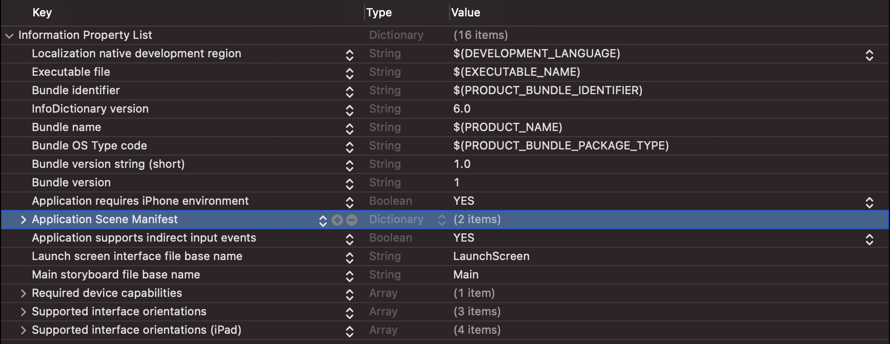
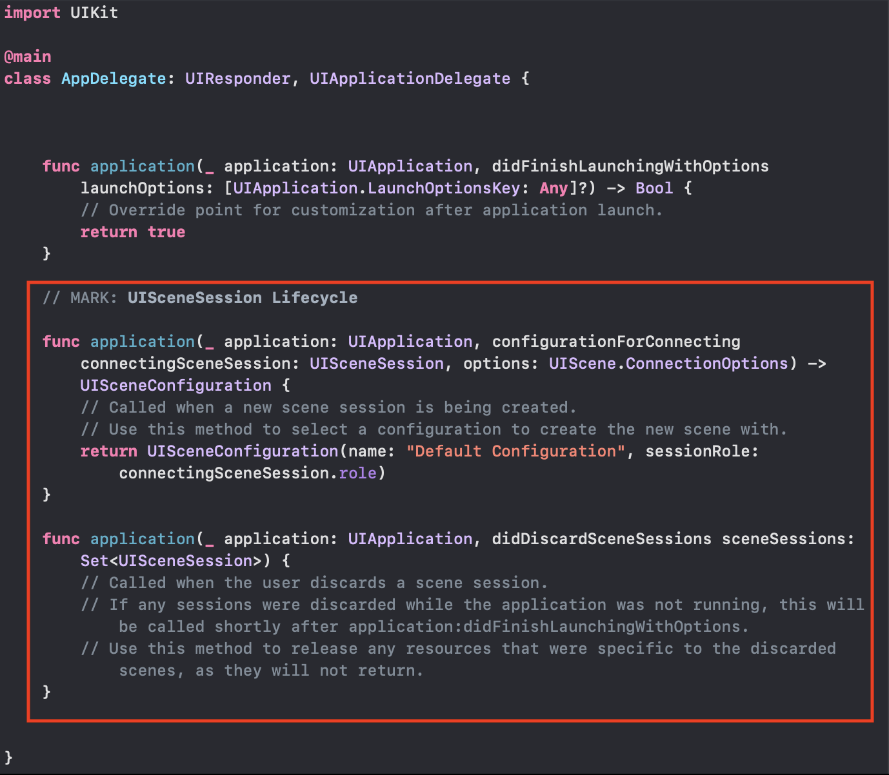
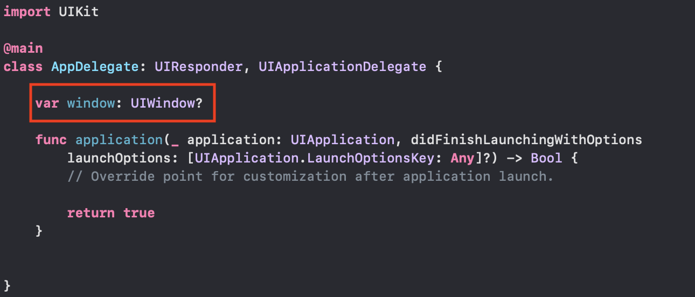
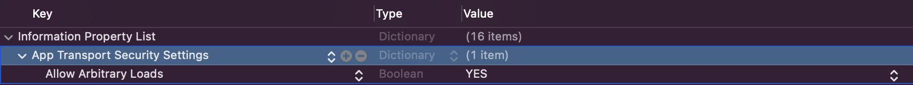

# 테이블뷰 연습

## LaunchScreen

- 피그마 스티커 활용 (Smile Face)

  - Assets 에 이미지 추가(@2)

- 스토리보드에 UIImageView 추가 및 오토레이아웃 설정

  - 가운데 정렬, 이미지 비율 등등
  - Smile Face 이미지 설정

- 스플래시 이미지 딜레이 시간 설정

  ```swift
  func application(_ application: UIApplication, didFinishLaunchingWithOptions launchOptions: [UIApplication.LaunchOptionsKey: Any]?) -> Bool {
          sleep(2) // 스플래시 이미지 딜레이 주기위해 추가한 부분
          return true
      }
  ```


## SceneDelegate 삭제

- 스토리보드만 사용할 것이라 SceneDelegate.swift 삭제 (SwiftUI는 아직 미사용)
  - 단순히 파일만 삭제하면 SceneDelegate가 필요하다는 메시지 뜸 -> 아래와 같이 해결

1. info.plist에서 아래 부분 삭제



2. AppDelegate.swift 에서 아래 영역 소스 코드 삭제



3. AppDelegate.swift 에서 아래 소스 코드 추가

- `The app delegate must implement the window property if it wants to use a main storyboard file.` 메시지 해결




## API 관련 설정

- 영화진흥위원회 OPEN API 활용 [링크](https://www.kobis.or.kr/kobisopenapi/homepg/main/main.do)
  - 회원가입 후 키 발급 신청
- 필요한 설정
  - Xcode http 설정
  - API KEY 숨기기
  - 등등..

1. Xcode 설정 바꾸기

   - Apple의 앱 전송 보안(ATS)때문에 http 통신 위해서 아래와 같은 설정 필요 (사용할 api가 http 통신 사용하기 때문)
   - Info.plist에서 아래 항목 추가

   

2. API KEY 숨기기

   - 키값은 공개하면 곤란(아직은 공부 목적이지만)

   - 간단한 방법 1: swift파일에 struct 하나 만들어서 그 안에 String으로 key 저장 후 gitignore 추가하기

   - 사용한 방법

     - plist 파일 생성 (또는 Info.plist 활용) 후 Key - Value 에 API KEY 값 작성
       - 해당 plist 파일 gitignore 추가하기
     - Bundle extension에 아래와 같이 작성 

     ```swift
     extension Bundle {
         var apiKey: String {
           get {
             guard let filePath = self.path(forResource: "Properties", ofType: "plist") else { return "" }
     
             guard let resource = NSDictionary(contentsOfFile: filePath) else { return "" }
             
             guard let key = resource["API_KEY"] as? String else {
               fatalError("API_KEY 설정이 필요합니다.")
             }
             
             return key
           }
         }
     }
     ```

     - 아래와 같이 사용

     ```swift
     let api_key = Bundle.main.apiKey
     ```


## 날짜 계산

- 오늘 날짜

```swift
let date = Date()
```

- 일주일 전 날짜

```swift
let dateBefore7Days = Calendar.current.date(byAdding: .day, value: -7, to: date)
// 옵셔널 반환
// value 음/양 정수 입력
```

- 문자열로 변환

```swift
let formatter = DateFormatter()
formatter.dateFormat = "yyyyMMdd" // 원하는 출력 형식 작성
let current_date = formatter.string(from: dateBefore7Days!)
```


## VO (Value Object)

- 값을 저장하기 위한 객체
- 읽기 전용 (getter / read only)
- 비슷하지만 다른 DTO(Data Transfer Object)
  - 데이터를 오브젝트로 변환하는 객체 / 데이터를 전달하기 위해 사용하는 객체
  - 가변적 (getter, setter)